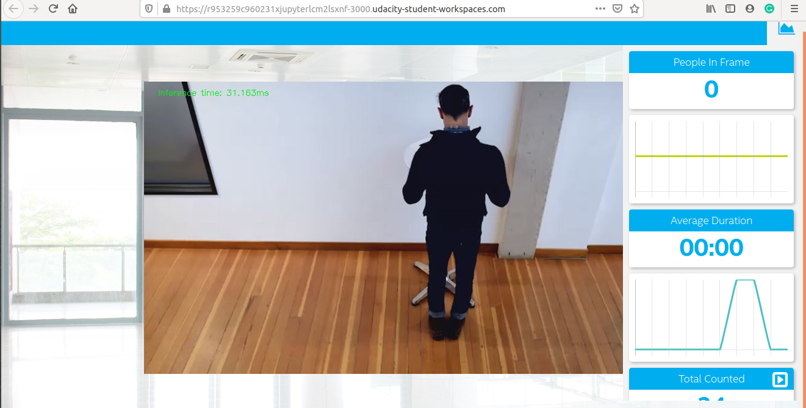

# Project Write-Up            

OpenVINO people counter app deployment at edge. The Intel's distribution of openVINO toolkit allow us to deploy models at the edge with less compuation power required for edge resources. In this project we developed a people counter app comparing different models, pre and post IR conversions and computing the performance/sizes of the models. Read the complete guide to get further insight into the Intel's distribution of openVINO toolkit.

## Explaining Custom Layers

The list of  supported layers directly relates to whether a given layer is a custom layer. If a layer is not in the list of supported layers is automatically classified as a custom layer by the Model Optimizer.

There are some options to add custom layers:

### For Caffe Models

#### Option 01: 
Register the custom layers as extensions to the Model Optimizer. When your custom layers are registered as extensions, the Model Optimizer generates a valid and optimized Intermediate Representation. And then we can generate a valid Intermediate Representation according to the rules specified. In this option the availability of Caffe on local machine is not required.

#### Option 02: 
Register the custom layers as Custom and use the system Caffe to calculate the output shape of each Custom Layer, which is required by the Intermediate Representation format. For this method, the Model Optimizer requires the Caffe Python interface on the system. When registering the custom layer in the CustomLayersMapping.xml file, we can specify if layer parameters should appear in Intermediate Representation or if they should be skipped.

Note: If your layer output shape depends on dynamic parameters, input data or previous layers parameters, calculation of output shape of the layer via Caffe can be incorrect. In this case, patch to Caffe is required.
If the calculation of output shape of the layer via Caffe fails inside the framework, Model Optimizer is unable to produce any correct Intermediate Representation and a patch is also required in the Caffe.

### For TensorFlow Models

#### Option 01: 
This option is similar to Option 01 of Caffe Model. Register the custom layers as extensions to the Model Optimizer. When your custom layers are registered as extensions, the Model Optimizer generates a valid and optimized Intermediate Representation.

#### Option 02: 
Replace the unsupported subgraph with a different subgraph. The sub-graphs that should not be expressed with the analogous sub-graph in the Intermediate Representation, but another sub-graph should appear in the model, the Model Optimizer provides such an option. This feature is helpful for many TensorFlow models.

#### Option 03: 
Offload the computation of the subgraph back to TensorFlow during inference.

### MXNet Models with Custom Layers

#### Option 01: 
Register the custom layers as extensions to the Model Optimizer.When the custom layers are registered as extensions, the Model Optimizer generates a valid and optimized Intermediate Representation.

#### Option 02: 
If there are sub-graphs that should not be expressed with the analogous sub-graph in the Intermediate Representation, but another sub-graph should appear in the model, the Model Optimizer provides such an option. In MXNet the function is actively used for ssd models provides an opportunity to for the necessary subgraph sequences and replace them.

It is necessary to cope with custom layers so that the performace of the model at the edge may not be compromised. 

## Comparing Model Performance

I have converted different models into IR and compared the performance and my results are given below.

First Model: SSD Lite MobileNet V2 COCO (http://download.tensorflow.org/models/object_detection/ssdlite_mobilenet_v2_coco_2018_05_09.tar.gz)
This model shows very poor efficiency in detceting people rest of the details are mentioned in Model Research topic.

The difference between model accuracy pre- and post-conversion was...

The size of the model pre- and post-conversion was...

The inference time of the model pre- and post-conversion was...

## Assess Model Use Cases

There are a lot of use cases of this model can be,
1. To get the head count of the people in a rally
2. To count people in a stadium
3. It can be used in current COVID-19 pendamic to not to gather people more than certian at one place

Each of these use cases would be useful because we are dealing with the safety of people by deploying models at the edge.

## Assess Effects on End User Needs

Lighting, model accuracy, and camera focal length/image size have different effects on a
deployed edge model. The potential effects of each of these are as follows

1. Camera angle can affect the performancce the model and can give us false count of the people.
2. Model accuracy is a big pre-requisit in success this app at the edge. 

## Model Research

[This heading is only required if a suitable model was not found after trying out at least three
different models. However, you may also use this heading to detail how you converted 
a successful model.]

In investigating potential people counter models, I tried each of the following three models:
#wget link to model
#tar -xvf model name

Model 1: [SSD Lite MobileNet V2 COCO] (http://download.tensorflow.org/models/object_detection/ssdlite_mobilenet_v2_coco_2018_05_09.tar.gz)
  - I converted the model to an Intermediate Representation with the following arguments...
  python /opt/intel/openvino/deployment_tools/model_optimizer/mo.py --input_model frozen_inference_graph.pb --tensorflow_object_detection_api_pipeline_config pipeline.config --reverse_input_channels --tensorflow_use_custom_operations_config /opt/intel/openvino/deployment_tools/model_optimizer/extensions/front/tf/ssd_v2_support.json

The model was insufficient for the app because the output to person detection is fluctuating therefore false increment to total counted people in the video. Also some people are passing undetected.
As in the screenshot attached it is clrealy visible the total count which is incremented falsely.

  
## Model 2: [Mask R-CNN Inception V2 COCO] (http://download.tensorflow.org/models/object_detection/mask_rcnn_inception_v2_coco_2018_01_28.tar.gz)
  - [Model Source]
  Download the model to workspace by 
  wget http://download.tensorflow.org/models/object_detection/mask_rcnn_inception_v2_coco_2018_01_28.tar.gz
  
  extract using
  
  tar -xvf mask_rcnn_inception_v2_coco_2018_01_28.tar.gz
  
  cd to model directory
  cd mask_rcnn_inception_v2_coco_2018_01_28
  
  and run the command for model IR conversion
  
  python /opt/intel/openvino/deployment_tools/model_optimizer/mo.py --input_model frozen_inference_graph.pb --tensorflow_object_detection_api_pipeline_config pipeline.config --reverse_input_channels --tensorflow_use_custom_operations_config /opt/intel/openvino/deployment_tools/model_optimizer/extensions/front/tf/mask_rcnn_support.json
  
  - I converted the model to an Intermediate Representation with the following arguments...
  - The model was insufficient for the app because...
  - I tried to improve the model for the app by...

- Model 3: [Name]
  - [Model Source]
  - I converted the model to an Intermediate Representation with the following arguments...
  - The model was insufficient for the app because...
  - I tried to improve the model for the app by...

for run the app 

python main.py -i resources/Pedestrian_Detect_2_1_1.mp4 -m ssdlite_mobilenet_v2_coco_2018_05_09/frozen_inference_graph.xml -l /opt/intel/openvino/deployment_tools/inference_engine/lib/intel64/libcpu_extension_sse4.so -d CPU -pt 0.6 | ffmpeg -v warning -f rawvideo -pixel_format bgr24 -video_size 768x432 -framerate 24 -i - http://0.0.0.0:3004/fac.ffm
